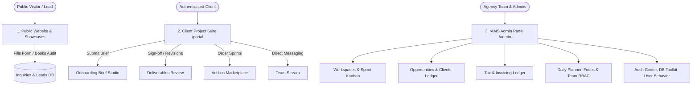
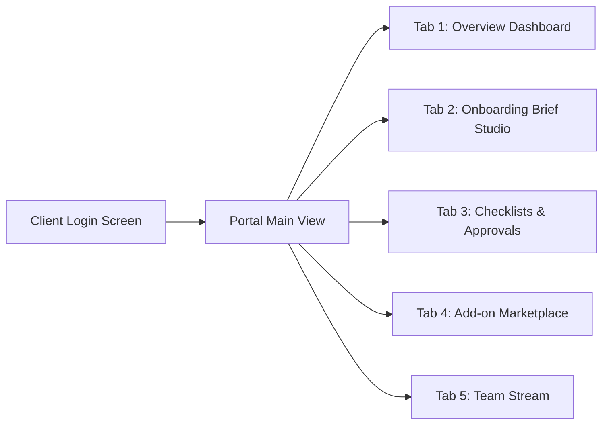
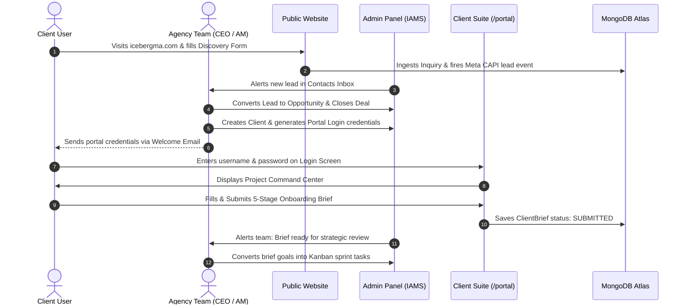
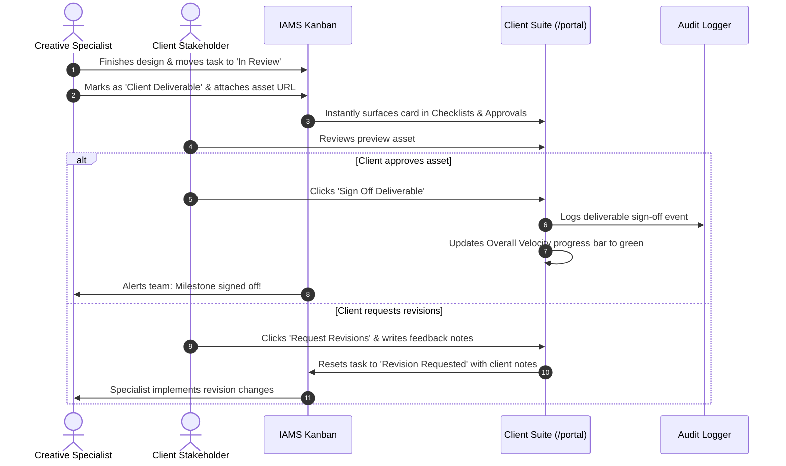
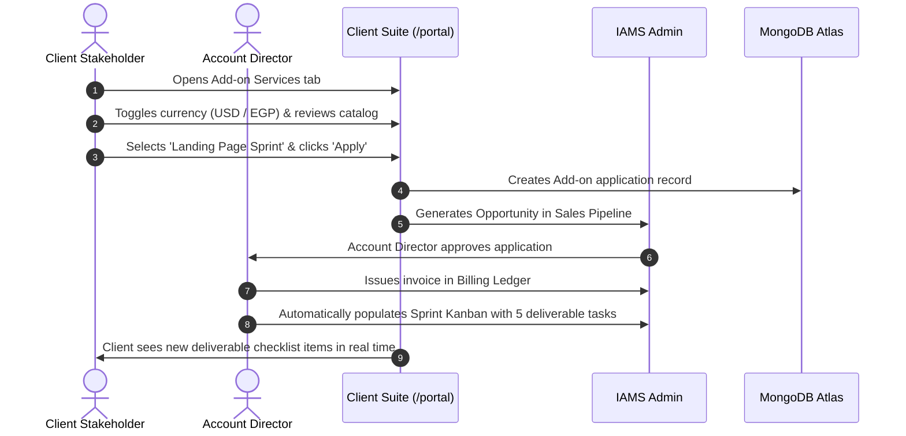

# ICEBERG Digital Marketing Agency — Full Website, Admin & Client Screens Documentation

> **Official System & UI Specification Guide**  
> **Platform Version:** ICEBERG Suite 2026 (v2.4 LTS)  
> **Architectural Paradigm:** Glassmorphism UI + Express.js/MongoDB Atlas + Zero-Leakage Multi-Tenant Client Scoping  

---

## 📑 Table of Contents

1. [System Architecture & Screen Ecosystem](#1-system-architecture--screen-ecosystem)
2. [Role-Based Access Control (RBAC) Matrix](#2-role-based-access-control-rbac-matrix)
3. [Public Website & Marketing Screens](#3-public-website--marketing-screens)
   - 3.1. Main Agency Landing Page (`index.html`)
   - 3.2. Projects & Case Studies (`projects.html`)
   - 3.3. IDEX Exhibition Growth Studio (`idex.html`)
   - 3.4. Special Campaign & Interactive Showcase Screens
4. [Client Project Suite Screens (`/portal`)](#4-client-project-suite-screens-portal)
   - 4.1. Screen 1: Client Authentication & Gateway
   - 4.2. Screen 2: Global Header & Project Command Bar
   - 4.3. Screen 3: Overview Dashboard (Tab 1)
   - 4.4. Screen 4: Strategic Onboarding Brief Studio (Tab 2)
   - 4.5. Screen 5: Checklists & Deliverables Approval Queue (Tab 3)
   - 4.6. Screen 6: Add-on Services Marketplace (Tab 4)
   - 4.7. Screen 7: Team Stream Live Channel (Tab 5)
5. [Admin & Agency Management System (IAMS) Screens (`/admin`)](#5-admin--agency-management-system-iams-screens-admin)
   - 5.1. Authentication & Navigation Architecture
   - 5.2. Dashboard Overview (`#dashboard`)
   - 5.3. Traffic & Funnel Analytics (`#analytics`)
   - 5.4. Dynamic Content Management (`#content`)
   - 5.5. Portfolio & Project Manager (`#projects`)
   - 5.6. Service Offerings Catalog (`#services`)
   - 5.7. Contact Inquiries & Leads Inbox (`#contacts`)
   - 5.8. Showcase Marquee & Partner Logos (`#showcase`, `#clients`)
   - 5.9. IDEX Exhibition & Trade Show Suite (`#idex-*`)
   - 5.10. IAMS Clients & Retainers Overview (`#iams-overview`)
   - 5.11. Client Deep-Dive Profile & Portal Credentialing (`#iams-client-detail`)
   - 5.12. Sprint Kanban Board (`#iams-kanban`)
   - 5.13. Invoices & Tax Ledger (`#iams-billing`)
   - 5.14. Projects & Collaborative Workspaces (`#upbase-workspaces`)
   - 5.15. Daily Planner & Time-Grid Scheduler (`#upbase-planner`)
   - 5.16. Focus & Ambient Audio Studio (`#upbase-focus`)
   - 5.17. Sales Opportunities & Deal Pipeline (`#opportunities`)
   - 5.18. KPI & SLA Performance Reports (`#kpi-reports`)
   - 5.19. Staff Operations & RBAC Management (`#staff-management`)
   - 5.20. Audit Center & Security Forensics (`#audit-center`)
   - 5.21. Database Toolkit & Collection Inspector (`#db-center`)
   - 5.22. User Behavior & Telemetry Heatmaps (`#user-behavior`)
6. [Cross-System Screen Flow & User Journeys](#6-cross-system-screen-flow--user-journeys)
7. [Screen Route & API Mapping Reference](#7-screen-route--api-mapping-reference)

---

## 1. System Architecture & Screen Ecosystem

ICEBERG operates as a **tri-portal ecosystem** engineered for high-performance marketing, tight collaborative execution, and client transparency:

### Core Architecture Pillars:
1. **Public Marketing Tier (`public/`):** High-converting, SEO-optimized, bilingual (English & Arabic RTL) responsive web application utilizing GSAP animations, Tailwind CSS, 3D interactive canvases, and dynamic CMS hydration.
2. **Client Project Suite (`public/portal/`):** Isolated, zero-leakage client gateway providing real-time deliverable review, onboarding automation, feedback loops, and on-demand upsell capabilities.
3. **Agency Management System / IAMS (`public/admin/`):** Enterprise-grade operations center merging project management (similar to ClickUp/Upbase), CRM pipelines, billing ledgers, staff time-allocation, and developer diagnostics.

---

## 2. Role-Based Access Control (RBAC) Matrix

Access across admin modules and client screens is governed by the centralized permission matrix defined in `lib/middleware/roleMatrix.js`:

| Role Level | Canonical Role | Legacy Equivalent | Accessible Scope | Key Permissions & Screen Visibility |
| :--- | :--- | :--- | :--- | :--- |
| **Level 10** | **CEO** | `SUPER_ADMIN`, `ADMIN` | **Global (Internal + All Clients)** | Full administrative rights, staff management, tax & billing ledgers, project deletions, database toolkit, security audits. |
| **Level 8** | **CreativeDirector** | `ACCOUNT_MANAGER` | **All Client Workspaces + Internal** | Full access to creative boards, client briefs, deliverable uploads, sprint kanban, team stream. Restricted from viewing tax ledgers, deleting projects, or editing staff credentials. |
| **Level 6** | **MarketingManager** | `SPECIALIST`, `MEMBER` | **Assigned Client Workspaces + Internal** | Task execution, campaign metric reporting, deliverable submission, daily planner, sprint board management. Restricted from billing and global settings. |
| **Level 2** | **ClientGuest** | `CLIENT_VIEWER`, `GUEST` | **Strict Single-Project Scope** | `/portal` access exclusively. View only assigned project sprint items, onboarding brief submission, deliverable approvals, add-on requests, and dedicated team chat. |

---

## 3. Public Website & Marketing Screens

### 3.1. Main Agency Landing Page (`public/index.html` & `public/Home.html`)
The public storefront showcases agency authority, past achievements, and digital capabilities.

* **Top Global Navigation Header:**
  * **Brand Logo:** Iceberg glowing emblem with smooth home-scroll.
  * **Navigation Links:** Smooth scrolling to `#home`, `#about`, `#services`, `#process`, `#projects`, `#contact`.
  * **Language Switcher (EN / AR):** Toggles document direction (`ltr` / `rtl`), switches font family to Cairo/Tajawal for Arabic, and rehydrates UI copy dynamically.
  * **Interactive Theme / Audio Toggles:** Sound effects on hover/click and visual glassmorphism enhancements.
  * **Action CTAs:** "Client Portal" (directs to `/portal`) and "Book Discovery Call" (opens booking modal).
* **Section `#home` — 3D Interactive Hero:**
  * Kinetic typography headline: *"Scale Beyond the Horizon"*.
  * Ambient 3D floating iceberg particles (WebGL/Three.js and GSAP animations).
  * Fast-action pills: *"Bilingual Marketing"*, *"Meta CAPI Integrated"*, *"3.8x Average Client ROAS"*.
  * Primary conversion buttons: *"Explore Work"* and *"Start a Project"*.
* **Section `#clients` — Trust Marquee & Client Logos:**
  * Infinite horizontal marquee displaying verified client logos (DentaQuik, Acrostone, Musical Bag, Ghost Note, etc.).
  * High-profile client case metrics.
* **Section `#about` — The Iceberg Philosophy:**
  * Narrative: *"What you see on the surface is 10% — the 90% beneath is strategy, engineering, and data architecture."*
  * Agency statistics grid: +$12M Ad Spend Managed, 99.4% SLA Delivery, 45+ Enterprise Launches.
* **Section `#services` — Interactive Service Matrix:**
  * 6 Core Service Cards with micro-animations and expandable deliverable outlines:
    1. Performance Marketing & Paid Acquisition (Meta, TikTok, Google Ads).
    2. High-Velocity Web & Next-Gen App Engineering.
    3. Creative Direction, 3D CGI & Viral Video Production.
    4. Strategic Brand Identity & Visual Systems.
    5. Funnel Optimization & Conversion Rate Optimization (CRO).
    6. Search Engine Optimization & Programmatic Indexing.
* **Section `#process` — The 4-Step Agency Engine:**
  * Interactive roadmap: `01 Discovery & Audit` → `02 Strategic Blueprint` → `03 Sprint Execution` → `04 Algorithmic Scale`.
* **Section `#contact` — Multi-Step Discovery Wizard:**
  * Integrated contact form with real-time field validation.
  * Step-based selection: Project Type, Monthly Budget Range, Target Timeline, Project Objectives.
  * Automated email dispatch via Nodemailer and instant CRM ingestion.
* **Floating AI Agent Widget (`public/ai-agent-widget.js`):**
  * Persistent bottom-right floating badge.
  * Expands into an intelligent marketing assistant capable of answering client questions, explaining services, and capturing qualified leads.

---

### 3.2. Projects & Case Studies Screen (`public/projects.html`)
The dedicated agency portfolio showcasing measurable client outcomes.

* **Portfolio Filter Bar:** Filter by category (`All`, `Branding & Visuals`, `Web & Engineering`, `Paid Performance`, `Video & 3D`).
* **Dynamic Project Grid:**
  * High-resolution project hero previews with hover tilt effects.
  * Key outcome metrics badges (e.g., *"+320% Qualified Leads"*, *"1.2s Load Time"*).
  * Direct links to live staging environments or detailed case study modals.
* **Case Study Deep-Dive Modal:**
  * Executive Challenge, Strategic Solution, Tech Stack Used, and Measurable Deliverables list.

---

### 3.3. IDEX Exhibition Growth Studio (`public/idex.html` & `public/idex-thank-you.html`)
Specialized high-converting landing page built for defense and industry trade exhibitions (IDEX / NAVDEX).

* **Exhibition Booth Hero:** Specialized for defense exhibitors needing rapid marketing footprints.
* **Free Digital Presence Audit Request:** Instant submission form for exhibitors to receive a diagnostic audit of their digital presence.
* **Interactive Booth Meeting Slot Scheduler:** Calendar selector allowing exhibition attendees to book 15-minute consultations at the agency's booth.
* **Exhibition Growth Packages:** Turnkey pre-built bundles (Booth Launch Pack, VIP Media Pack, Full Scale Expo Presence).
* **Interactive ROI Calculator:** Sliders for expected booth traffic, average deal size, and conversion probability.
* **Confirmation Screen (`idex-thank-you.html`):** Custom post-submission verification with calendar event download (`.ics`) and WhatsApp direct hotline.

---

### 3.4. Special Campaign & Interactive Showcase Screens
* **Birthday / Anniversary Campaign (`public/birthday-campaign.html`):** Gamified promotion page offering limited-time promotional credits and services.
* **Dynamic Marquees & Showcases (`public/showcase/`, `public/ads-showcase/`):** High-density media screens displaying agency creative reels, high-converting ad variants, and packaging designs.

---

## 4. Client Project Suite Screens (`/portal`)

The Client Suite is a purpose-built client portal delivering a seamless collaboration experience with zero data leakage between different clients.

### 4.1. Screen 1: Client Authentication & Gateway
* **URL:** `/portal` (Unauthenticated state)
* **Visual Style:** Deep Space Obsidian (`#070b14`) with glassmorphism card and cyan ambient glow.
* **Interactive Components:**
  * `Account ID / Client Username` input field.
  * `Secure Project Password` input field with toggleable show/hide eye icon.
  * Dynamic error banner (handles locked accounts, incorrect credentials, or unassigned projects).
  * Direct Account Director hotline link (`accounts@icebergma.com`).
* **Underlying Logic:** Authenticates via `POST /api/iams/portal/login`. Issues a scoped JWT token storing `client_id`, `project_id`, and `role: ClientGuest`.

---

### 4.2. Screen 2: Global Header & Project Command Bar
* **Persistent Top Header:**
  * **Brand Mark:** Iceberg Client Suite badge.
  * **Company Context:** Displays the active client company name (e.g. *DentaQuik*, *Acrostone*).
  * **Live Sprint Status Badge:** Pulsing green indicator showing active sprint status and category.
  * **Client Identity Pill:** User avatar initials, full name, and client username.
  * **Sign Out Button:** Clears local credentials, revokes session, and redirects to login.
* **Sub-Header Navigation Tabs:**
  * `Overview` (Icon: layout-dashboard)
  * `Onboarding Brief` (Icon: file-text, with completion % badge)
  * `Checklists & Approvals` (Icon: check-circle-2, with pending review counter)
  * `Add-on Services` (Icon: sparkles, badge: Catalog)
  * `Team Stream` (Icon: message-square)

---

### 4.3. Screen 3: Overview Dashboard (Tab 1)
* **Hero Project Banner:**
  * Project Title, Category Pill, and Target Launch countdown timer (e.g. *"14 Days to Target Launch"*).
  * **Overall Velocity Bar:** Real-time progress bar calculated from completed deliverables vs. total sprint items.
  * **Project Hubs Bar:** Instant external quick links:
    * `Staging Preview` (Direct link to staging domain)
    * `Figma Workspace` (Direct link to design boards)
    * `Shared Drive Assets` (Google Drive / Dropbox asset folder)
    * `Edit Brand Brief` (Jumps straight to Brief Studio)
* **4 Metric KPI Cards Grid:**
  1. **Deliverables Signed Off:** Count of approved creative assets.
  2. **Awaiting Client Review:** Highlighted amber card showing items currently requiring client decision.
  3. **Onboarding Brief Completeness:** Dynamic percentage score of the strategic brief.
  4. **Agency SLA Health:** Guaranteed uptime and delivery health badge (*"100% HEALTHY"*).
* **Assigned Agency Team Cards:**
  * **Account Director Card:** Dedicated account lead with 1-click WhatsApp chat button and direct email link.
  * **Lead Specialist Card:** Lead engineer or creative director overseeing quality assurance.
* **Sprint Deliverables Queue:**
  * Summary list of recent milestone deliverables with immediate approval status tags.

---

### 4.4. Screen 4: Strategic Onboarding Brief Studio (Tab 2)
An interactive 5-stage intake studio replacing static briefing documents with an interactive, database-backed questionnaire.

* **Top Action Bar:** Shows current status (`DRAFT`, `SUBMITTED`, `IN_REVIEW`), *"Save Progress"* button, and *"Submit Final Onboarding Brief"* button.
* **Stage 1 — Brand Core & Value Proposition:**
  * Brand Story & Mission textarea.
  * Unique Value Proposition (USP) input.
  * Industry & Specialized Niche input.
* **Stage 2 — Target Audience & Customer Personas:**
  * Primary customer persona definition.
  * Core customer pain points to solve.
* **Stage 3 — Project Scope & Primary KPIs:**
  * Primary Goal selector (`High-Velocity Lead Generation`, `Brand Awareness & Dominance`, `E-Commerce Scaling`, `Complete Rebranding`, `Conversion Rate Optimization`, `Custom Enterprise`).
  * Quantitative Target KPIs input (e.g. *"150 leads/mo, 3.5x ROAS"*).
* **Stage 4 — Creative Direction, Aesthetics & Tone:**
  * Aesthetic Style dropdown (`Minimal & Luxury`, `Tech & Futuristic`, `Warm & Editorial`, `Bold & High-Energy`, `Clean Corporate`).
  * Brand Color Hex codes input.
  * Benchmark / Competitor URLs for creative inspiration.
* **Stage 5 — Brand Assets & Technical Handover:**
  * Shared Google Drive / Dropbox asset folder URL.
  * Brand Guidelines Figma / PDF link.
  * Technical access notes (DNS registrar, Google Tag Manager IDs, Meta Pixel permissions).

---

### 4.5. Screen 5: Checklists & Deliverables Approval Queue (Tab 3)
The operational core where clients inspect work, grant approvals, or request revisions.

* **Section A — Foundational Onboarding Milestones:**
  * Interactive roadmap checklists (e.g., *Access permissions verified*, *DNS records pointed*, *Brand questionnaire approved*, *Kickoff call completed*).
* **Section B — Sprint Deliverables & Creative Review Cards:**
  * Individual deliverable cards showing:
    * Asset title, category, and target completion date.
    * Live preview thumbnail or embedded video preview.
    * Asset download / preview link.
    * **Current Status Badge:** `IN_PROGRESS`, `PENDING_CLIENT_REVIEW`, `APPROVED`, `REVISION_REQUESTED`.
    * **Action Buttons:**
      * `Sign Off Deliverable` (Green button): Prompts instant sign-off confirmation, locks the deliverable, updates project velocity, and logs an immutable audit event.
      * `Request Revisions` (Amber button): Opens revision modal allowing clients to type specific, actionable feedback. Automatically resets task status to `REVISION_REQUESTED` and alerts the assigned specialist.

---

### 4.6. Screen 6: Add-on Services Marketplace (Tab 4)
An integrated marketplace where clients can instantly order agency sprint packages to expand their campaign scope.

* **Interactive Currency Switcher:** Instant toggle between `USD ($)` and `EGP (E£)`.
* **Add-on Catalog Grid:**
  1. **High-Converting Landing Page Sprint:** Custom UX wireframe, responsive code, CAPI tracking, A/B structure (7 days).
  2. **Meta & TikTok Performance Scaling Pack:** 10 ad creatives, video hooks, copy matrix, lookalike build (10 days).
  3. **Viral Video & Reels Batch:** 5 short-form concepts, motion graphics, sound design, captions (8 days).
  4. **Technical SEO & Search Dominance Sprint:** Indexing audit, JSON-LD schema, Core Web Vitals, 5 guest articles (14 days).
  5. **Dedicated Full-Stack Developer Sprint:** 20 hours of senior engineering, feature builds, QA, production deployment (5 days).
  6. **Brand Identity & Visual System Extension:** 3D assets, keynote decks, 25+ social templates, brand book PDF (12 days).
* **Application Modal:** Clients click *"Apply for Service"*, specify custom notes, and confirm submission.
* **My Service Applications Tracker:** Bottom section displaying all applied add-on services, submission timestamps, review status, and direct conversion into active project tasks.

---

### 4.7. Screen 7: Team Stream Live Channel (Tab 5)
* **Direct Project Communication Channel:**
  * Clean chat thread between the client stakeholders and the dedicated agency team (Account Director, Creative Director, Lead Specialist).
  * Chronological chat bubbles with sender badge, user role, and timestamp.
  * Real-time composer supporting text feedback and project queries.
  * Direct backend persistence via `POST /api/iams/portal/messages`.

---

## 5. Admin & Agency Management System (IAMS) Screens (`/admin`)

The internal agency suite accessible by staff members at `/admin/index.html`. Features dynamic role-based visibility gates (`data-rbac-feature`).

```mermaid
graph TD
    AdminNav[Admin Sidebar Navigation]
    AdminNav --> S1[Dashboard Overview #dashboard]
    AdminNav --> S2[Analytics & Traffic #analytics]
    AdminNav --> S3[Content CMS #content]
    AdminNav --> S4[Projects Portfolio #projects]
    AdminNav --> S5[Services Manager #services]
    AdminNav --> S6[Contacts CRM #contacts]
    AdminNav --> S7[IDEX Exhibition Suite #idex-*]
    AdminNav --> S8[Clients & Retainers #iams-overview]
    AdminNav --> S9[Client Deep Profile #iams-client-detail]
    AdminNav --> S10[Sprint Kanban #iams-kanban]
    AdminNav --> S11[Invoices & Tax Ledger #iams-billing]
    AdminNav --> S12[Workspaces #upbase-workspaces]
    AdminNav --> S13[Daily Planner #upbase-planner]
    AdminNav --> S14[Focus Studio #upbase-focus]
    AdminNav --> S15[Opportunities Pipeline #opportunities]
    AdminNav --> S16[KPI & SLA Reports #kpi-reports]
    AdminNav --> S17[Employees & RBAC #staff-management]
    AdminNav --> S18[Audit Center #audit-center]
    AdminNav --> S19[Database Toolkit #db-center]
    AdminNav --> S20[User Behavior #user-behavior]
```

### 5.1. Authentication & Navigation Architecture
* **Admin Login Modal:** Secure JWT authentication modal with remember-me support, password visibility toggling, and auto-logout on token expiration.
* **Collapsible Sidebar Navigation:**
  * Toggle button for full-width vs. icon-only collapsed sidebar.
  * Section Headers: Agency Operations, Events & Exhibitions, IAMS Suite, Development Tools.
  * Role Badge indicator (e.g. `CEO`, `Creative Director`, `Marketing Manager`).

---

### 5.2. Dashboard Overview (`#dashboard`)
The central executive cockpit for day-to-day agency health.

* **Top Metric Tiles:**
  * Total Content Items, Active Portfolio Projects, Live Services, Total Inquiries, Active Client Retainers.
* **Quick Action Buttons:** *"Create Client"*, *"New Project Workspace"*, *"Record Invoice"*, *"Seed Test Data"*.
* **Recent Activity Feed:** Real-time stream of actions taken across the system (e.g., client brief submitted, deliverable signed off, invoice paid).
* **System Status Diagnostics:** MongoDB connection health, API latency, and environment indicators.

---

### 5.3. Traffic & Funnel Analytics (`#analytics`)
Marketing analytics and visitor tracking dashboard.

* **KPI Header Tiles:** Unique Visitors, Page Views, Average Session Duration, Bounce Rate, Conversion Rate.
* **Interactive Line Charts:** Visitor trends over 7d, 30d, 90d, or custom date ranges.
* **Device Breakdown Chart:** Mobile vs. Desktop vs. Tablet visitor distribution.
* **Traffic Sources & Referrers:** Direct, Google Organic, Meta Ads, LinkedIn, Referral domains.
* **Top Performing Pages:** URL paths ranked by view counts and dwell time.

---

### 5.4. Dynamic Content Management (`#content`)
Live CMS for website copy without code redeployments.

* **Section Selector:** Filter by page section (`Hero`, `About`, `Services`, `Process`, `Contact`, `Footer`).
* **Bilingual Translation Editor:**
  * Side-by-side editing of English and Arabic copy.
  * Live character count and rich text styling support.
* **Instant Sync:** Saves changes to MongoDB and invalidates server cache immediately.

---

### 5.5. Portfolio & Project Manager (`#projects`)
Complete management for the public portfolio showcase.

* **Projects Table & Grid:** Title, Category, Client Name, Featured Status toggle, Created Date.
* **Create / Edit Project Modal:**
  * Project Title (EN & AR), Category, Client Name, Case Study Body.
  * Thumbnail and gallery image upload (direct Cloudinary / S3 / local uploads).
  * Deliverable tags and live project URLs.

---

### 5.6. Service Offerings Catalog (`#services`)
Manages agency service tiers displayed on the public website.

* **Service List Table:** Icon preview, Service Name, Deliverables count, Pricing display, Actions.
* **Service Modal:**
  * Service Title (EN/AR), Description (EN/AR), Lucide icon selector.
  * Bulleted deliverables list builder.
  * Feature highlight toggle.

---

### 5.7. Contact Inquiries & Leads Inbox (`#contacts`)
Centralized CRM inbox capturing all leads submitted across public forms and discovery wizards.

* **Inquiry Filter Tabs:** `All`, `Unread`, `Follow-up Required`, `Archived`.
* **Lead Detail Drawer:**
  * Name, Email, Phone number (with 1-click WhatsApp dialer), Company, Selected Budget, Timeline.
  * Message body and automated Meta Pixel / CAPI attribution tags.
* **Status Updates:** Toggle status (`NEW`, `CONTACTED`, `QUALIFIED`, `CONVERTED`, `SPAM`).
* **Export Action:** 1-click CSV download for external CRM sync.

---

### 5.8. Showcase Marquee & Partner Logos (`#showcase`, `#clients`)
* **Showcase Marquee Editor (`#showcase`):** Reorder and toggle visibility of animated portfolio items on the homepage ticker.
* **Client Logos Manager (`#clients`):** Upload, sort, and manage high-resolution client logos displayed in the trust marquee.

---

### 5.9. IDEX Exhibition & Trade Show Suite (`#idex-*`)
Six dedicated management sub-screens designed for exhibition presence:

1. **IDEX Overview (`#idex-overview`):** Total exhibitor leads captured, audits requested, and booth consultation metrics.
2. **Exhibitor Leads CRM (`#idex-leads`):** Lead table with booth numbers, company names, contact persons, and follow-up flags.
3. **Exhibitor Audits (`#idex-audits`):** Intake queue of requested digital presence audits, scoring criteria, and audit report generator.
4. **Meeting Slots Calendar (`#idex-calendar`):** 15-minute slot management, booked vs available consultation times, calendar sync.
5. **Growth Packages (`#idex-packages`):** Exhibition-exclusive bundles, pricing tiers, and brochure downloads.
6. **Public Booth Screens (`#idex-screens`):** Interactive digital signage control panel for exhibition booth TV displays.

---

### 5.10. IAMS Clients & Retainers Overview (`#iams-overview`)
Agency account management command center.

* **Client Cards Grid:**
  * Company logo, client status pill (`ONBOARDING`, `ACTIVE_RETAINER`, `PAUSED`, `COMPLETED`).
  * Assigned Account Manager avatar.
  * Monthly Retainer Value ($ or EGP).
  * Quick buttons: *"View Deep Profile"*, *"Open Client Portal View"*, *"Generate Credentials"*.
* **Create Client Modal:**
  * Company name, slug, internal/external toggle, contact person name, email, phone, retainer tier.

---

### 5.11. Client Deep-Dive Profile & Credentialing (`#iams-client-detail`)
Detailed single-client view and portal management.

* **Client Header & Health Score:** Live SLA compliance status, active contract timeline.
* **Client Portal Credentials Generator:**
  * Set or reset client portal password.
  * Shows assigned username and 1-click copy for client login instructions.
* **Linked Project Workspaces:** Direct access to all workspaces associated with this client.
* **Onboarding Brief Inspector:** Review client responses submitted through the Client Portal Brief Studio with approval buttons.

---

### 5.12. Sprint Kanban Board (`#iams-kanban`)
High-velocity agency sprint board.

* **Filter Bar:** Filter by Client Workspace, Assigned Specialist, Priority (`URGENT`, `HIGH`, `MEDIUM`, `LOW`), or Due Date.
* **Kanban Columns:**
  * `Backlog` → `To Do` → `In Progress` → `In Review (Client Deliverable)` → `Completed`.
* **Task Card Features:**
  * Title, client badge, assignee avatar, due date badge (turns red when overdue).
  * Deliverable tag (marking it as client-facing).
  * Drag-and-drop status transitions with instant backend persistence.

---

### 5.13. Invoices & Tax Ledger (`#iams-billing`)
> *Gated by RBAC: Visible only to `CEO`.*

* **Financial Summary Cards:** Total Billed, Total Collected, Pending Receivables, Estimated Tax Liability.
* **Invoices Table:** Invoice #, Client Name, Issue Date, Due Date, Net Amount, Tax/VAT Rate, Status (`DRAFT`, `SENT`, `PAID`, `OVERDUE`).
* **Create Invoice Generator:** Itemized billable services, tax calculation, multi-currency support (USD / EGP), PDF export.

---

### 5.14. Projects & Collaborative Workspaces (`#upbase-workspaces`)
Comprehensive workspace management built on the Upbase model.

* **Workspace Tree:** Client Workspaces vs. Internal Agency Spaces (`Iceberg Internal`).
* **Workspace Views:**
  * **Tasks List View:** Grouped by section, priority, or assignee.
  * **Docs & Wiki:** Collaborative internal documentation, standard operating procedures (SOPs), and client guides.
  * **Files & Media Library:** Asset repository with file preview and download links.

---

### 5.15. Daily Planner & Time-Grid Scheduler (`#upbase-planner`)
Personalized timeblocking and productivity manager for agency team members.

* **Daily Priority List:** Pin top 3 must-win tasks for the day.
* **Hourly Timeblocking Grid (8:00 AM – 8:00 PM):** Drag tasks onto calendar blocks to allocate focused time.
* **Rollover Tasks Drawer:** Unfinished tasks automatically staged for quick scheduling into tomorrow's grid.

---

### 5.16. Focus & Ambient Audio Studio (`#upbase-focus`)
Deep-work environment for specialists and managers.

* **Pomodoro Focus Timer:** 25m focus / 5m break intervals with visual circular countdown.
* **Ambient Soundscapes:** High-fidelity audio sound generator (Rainfall, Deep Forest, White Noise, Cyberpunk Lo-Fi, Cafe Ambience).
* **Session Streak Tracker:** Tracks completed focus blocks per day to encourage uninterrupted execution.

---

### 5.17. Sales Opportunities & Deal Pipeline (`#opportunities`)
Visual CRM sales pipeline.

* **Deal Stage Columns:** `Lead In` → `Discovery Call` → `Proposal Sent` → `Negotiation` → `Closed Won` / `Closed Lost`.
* **Opportunity Card:** Deal name, estimated value ($ or EGP), close probability percentage, contact person, expected close date.
* **Pipeline Summary Bar:** Total pipeline value, weighted pipeline value, average deal cycle days.

---

### 5.18. KPI & SLA Performance Reports (`#kpi-reports`)
Executive reporting module tracking agency efficiency and quality.

* **Agency Velocity Index:** Deliverables delivered on-time vs. delayed.
* **Client Health Scoring:** Automated risk detection based on revision counts and review delays.
* **Specialist Workload Distribution:** Capacity tracking to prevent team burnout.

---

### 5.19. Staff Operations & RBAC Management (`#staff-management`)
> *Gated by RBAC: Visible only to `CEO`.*

* **Staff Directory Table:** Full name, email, department (`PERFORMANCE_MARKETING`, `BRANDING`, `ENGINEERING`, `OPERATIONS`), assigned role, last login timestamp.
* **Add / Edit Staff Modal:** Assign username, email, department, and role (`CEO`, `CreativeDirector`, `MarketingManager`).
* **Role Permission Viewer:** Real-time visual inspector showing what permissions each role possesses.

---

### 5.20. Audit Center & Security Forensics (`#audit-center`)
System security and integrity tracking.

* **Security Audit Log:** Immutable event log recording user logins, role changes, client brief updates, deliverable approvals, and deletion requests.
* **IP & User Agent Inspector:** Detects unusual geographical access or suspicious activity.
* **System Integrity Verification:** One-click automated check verifying database indexes, orphan records, and API route security.

---

### 5.21. Database Toolkit & Collection Inspector (`#db-center`)
Administrative database utility for MongoDB Atlas.

* **Collection Stats:** Document counts, storage sizes, and index counts for all collections (`users`, `clients`, `client_members`, `tasks`, `opportunities`, `invoices`, etc.).
* **Health & Repair Tools:** Clean orphaned records, re-index collections, export collections to JSONL backup.

---

### 5.22. User Behavior & Telemetry Heatmaps (`#user-behavior`)
Behavioral analytics tracking how visitors navigate the website.

* **Session Journeys:** Sequence of pages visited before filling a contact form or bouncing.
* **Click & Scroll Telemetry:** Aggregated click locations and average scroll depth across key landing pages.

---

## 6. Cross-System Screen Flow & User Journeys

### Journey 1: Client Onboarding & Project Kickoff

---

### Journey 2: Deliverable Review & Approval Loop

---

### Journey 3: Add-on Service Marketplace Upsell

---

## 7. Screen Route & API Mapping Reference

| Screen Name | View Location / Anchor | Primary API Endpoints Used | Accessible Roles |
| :--- | :--- | :--- | :--- |
| **Public Homepage** | `/index.html`, `/` | `GET /api/content`, `POST /api/contact` | Public / All |
| **Public Portfolio** | `/projects.html` | `GET /api/projects` | Public / All |
| **IDEX Exhibition** | `/idex.html` | `POST /api/leads/idex`, `GET /api/calendar/slots` | Public / All |
| **Client Sign-In** | `/portal` (Auth View) | `POST /api/iams/portal/login` | Public / Clients |
| **Portal Overview** | `/portal` (`#tab-view-overview`) | `GET /api/iams/portal/overview`, `GET /api/iams/portal/me` | `ClientGuest`, Staff |
| **Portal Brief Studio** | `/portal` (`#tab-view-brief`) | `GET /api/iams/portal/brief`, `PUT /api/iams/portal/brief` | `ClientGuest`, Staff |
| **Portal Deliverables** | `/portal` (`#tab-view-checklists`) | `GET /api/iams/portal/checklists`, `POST /api/iams/portal/deliverables/:id/review` | `ClientGuest`, Staff |
| **Portal Add-ons** | `/portal` (`#tab-view-addons`) | `GET /api/iams/portal/addons`, `POST /api/iams/portal/addons/apply` | `ClientGuest`, Staff |
| **Portal Team Stream** | `/portal` (`#tab-view-messages`) | `GET /api/iams/portal/messages`, `POST /api/iams/portal/messages` | `ClientGuest`, Staff |
| **Admin Dashboard** | `/admin#dashboard` | `GET /api/analytics/summary`, `GET /api/iams/analytics/vitals` | All Staff (`MarketingManager`+) |
| **Admin Analytics** | `/admin#analytics` | `GET /api/analytics/realtime`, `GET /api/analytics/devices` | All Staff |
| **Content CMS** | `/admin#content` | `GET /api/content`, `PUT /api/content` | All Staff |
| **Projects Manager** | `/admin#projects` | `GET /api/projects`, `POST /api/projects`, `DELETE /api/projects/:id` | All Staff |
| **Services Manager** | `/admin#services` | `GET /api/services`, `POST /api/services` | All Staff |
| **Contact CRM** | `/admin#contacts` | `GET /api/contact`, `PATCH /api/contact/:id` | All Staff |
| **IDEX Suite** | `/admin#idex-*` | `GET /api/leads/idex`, `GET /api/calendar/slots` | All Staff |
| **Clients Ledger** | `/admin#iams-overview` | `GET /api/iams/clients`, `POST /api/iams/clients` | All Staff |
| **Client Detail Profile**| `/admin#iams-client-detail` | `GET /api/iams/clients/:id`, `POST /api/iams/portal/admin/create-client-user` | All Staff |
| **Sprint Kanban** | `/admin#iams-kanban` | `GET /api/iams/tasks`, `PATCH /api/iams/tasks/:id/status` | All Staff |
| **Billing Ledger** | `/admin#iams-billing` | `GET /api/iams/invoices`, `POST /api/iams/invoices` | **CEO Only** |
| **Workspaces** | `/admin#upbase-workspaces`| `GET /api/iams/workspaces`, `POST /api/iams/workspaces` | All Staff |
| **Daily Planner** | `/admin#upbase-planner` | `GET /api/iams/planner`, `POST /api/iams/planner/blocks` | All Staff |
| **Focus Studio** | `/admin#upbase-focus` | `GET /api/iams/focus/sessions`, `POST /api/iams/focus/log` | All Staff |
| **Opportunities CRM** | `/admin#opportunities` | `GET /api/iams/opportunities`, `POST /api/iams/opportunities` | All Staff |
| **KPI Reports** | `/admin#kpi-reports` | `GET /api/iams/analytics/kpi` | All Staff |
| **Staff & RBAC** | `/admin#staff-management` | `GET /api/iams/employees`, `POST /api/iams/employees` | **CEO Only** |
| **Audit Center** | `/admin#audit-center` | `GET /api/iams/audit`, `POST /api/iams/audit/verify` | **CEO Only** |
| **Database Toolkit** | `/admin#db-center` | `GET /api/iams/database/stats`, `POST /api/iams/database/reindex` | **CEO Only** |
| **User Behavior** | `/admin#user-behavior` | `GET /api/iams/behavior/sessions`, `GET /api/iams/behavior/clicks` | All Staff |

---

*Documentation compiled and maintained for the ICEBERG Digital Marketing Agency Engineering & Operations Teams.*
